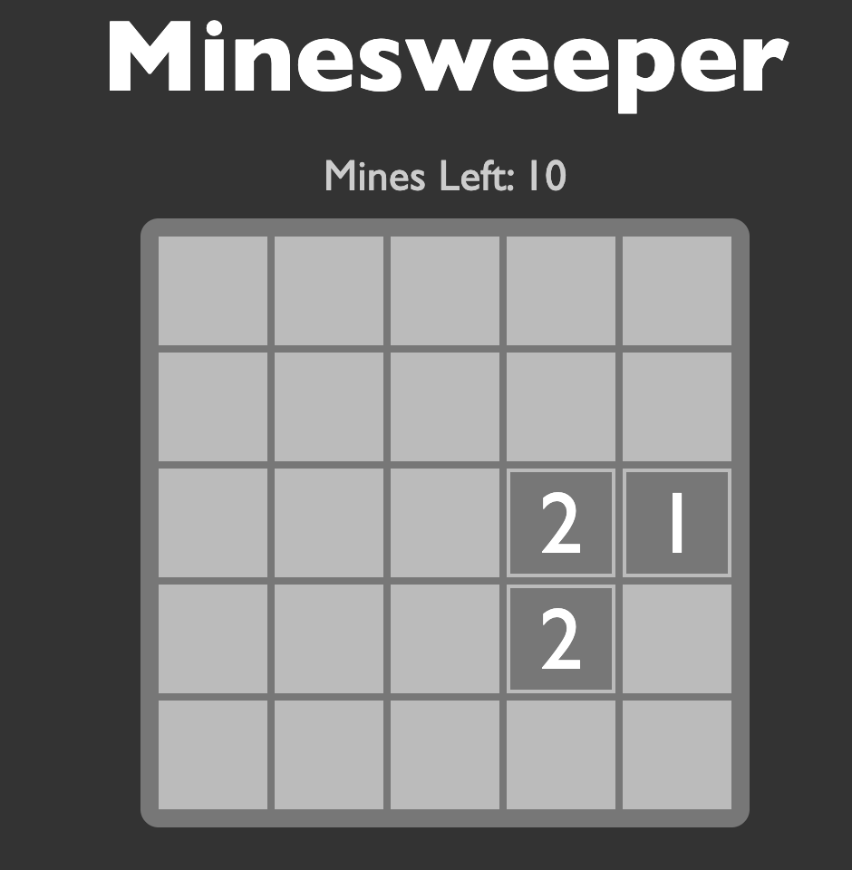
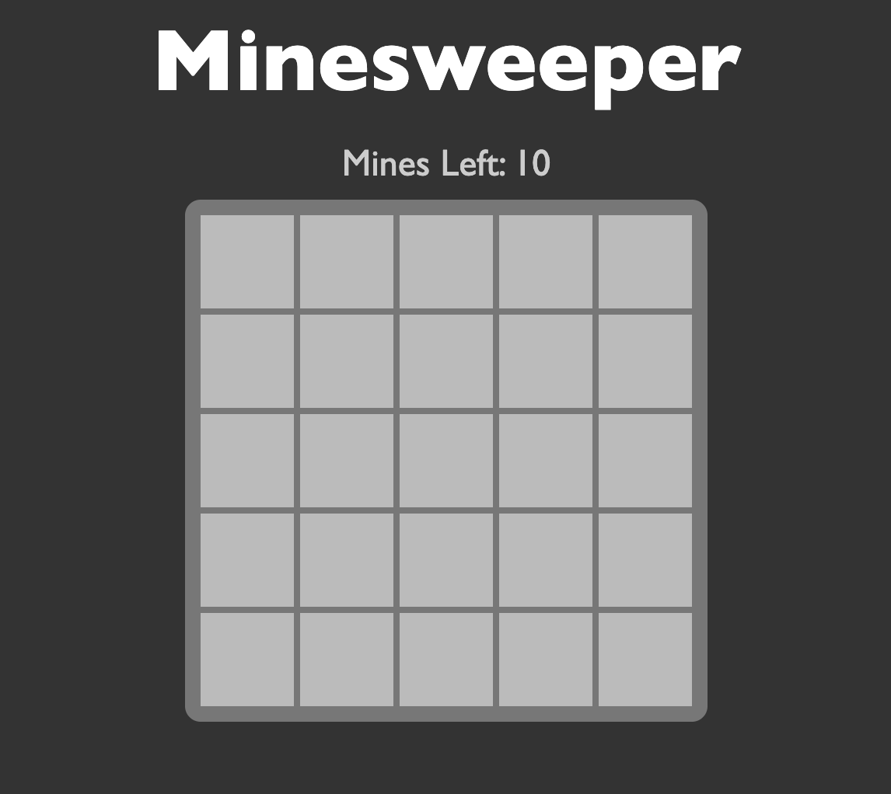
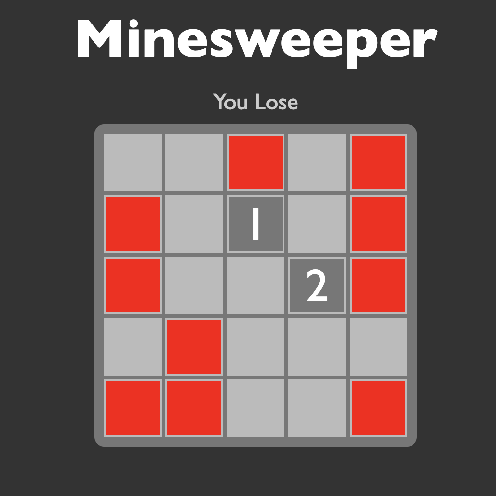

# Minesweeper

Simple minesweeper game built in html/css and JS

## Tech Stack

**Client:** HTML/CSS, JS.

## Screenshots

<div style="display: flex; ">

  

  

  

</div>

## Run Locally

Clone the project

```bash
  git clone https://github.com/Fogha/minesweeper.git
```

Go to the project directory

```bash
  cd minesweeper
```

Start app

```bash
  Open the HTML file in the browser
```

## Authors

- [@Armand Collins](https://www.github.com/Fogha)

## 🚀 About Me

I'm a full stack Javascript Developer. I Love to build beautiful and scalable web apps.

## 🔗 Links

[](https://www.linkedin.com/in/armand-collins-6974b3166)
[](https://twitter.com/locrae_)

## Badges

[](https://github.com/tterb/atomic-design-ui/blob/master/LICENSEs)


## Feedback

If you have any feedback, please reach out to me at foghaarmand@gmail.com
